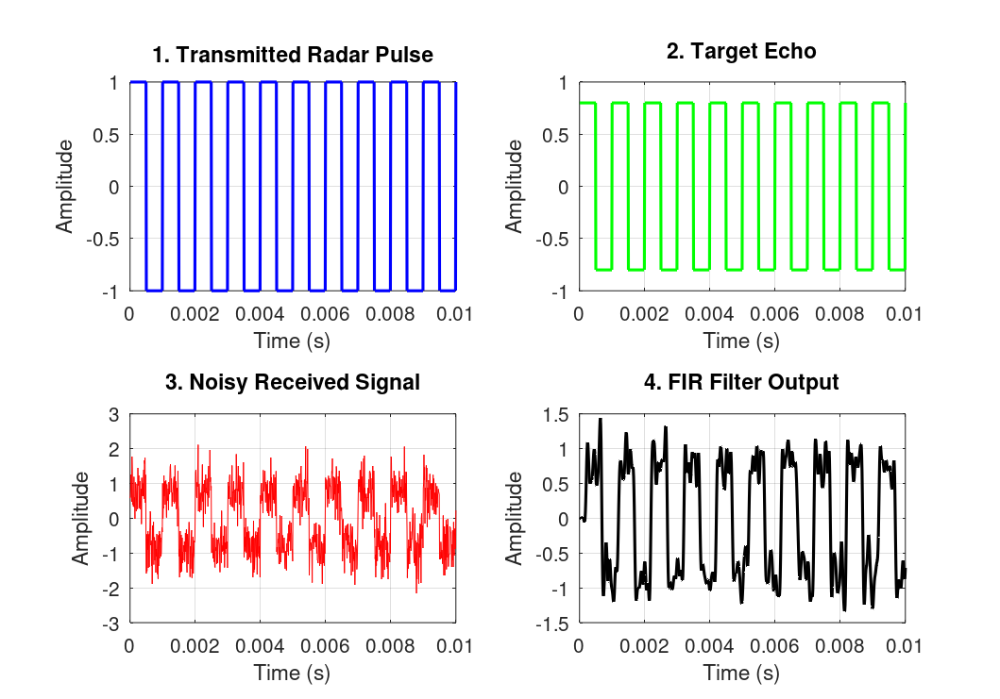
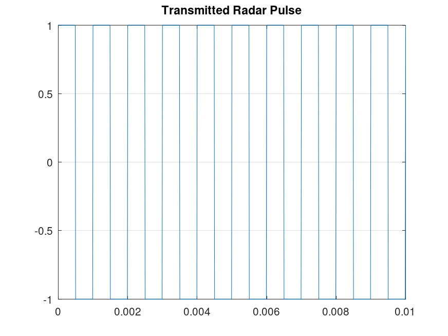
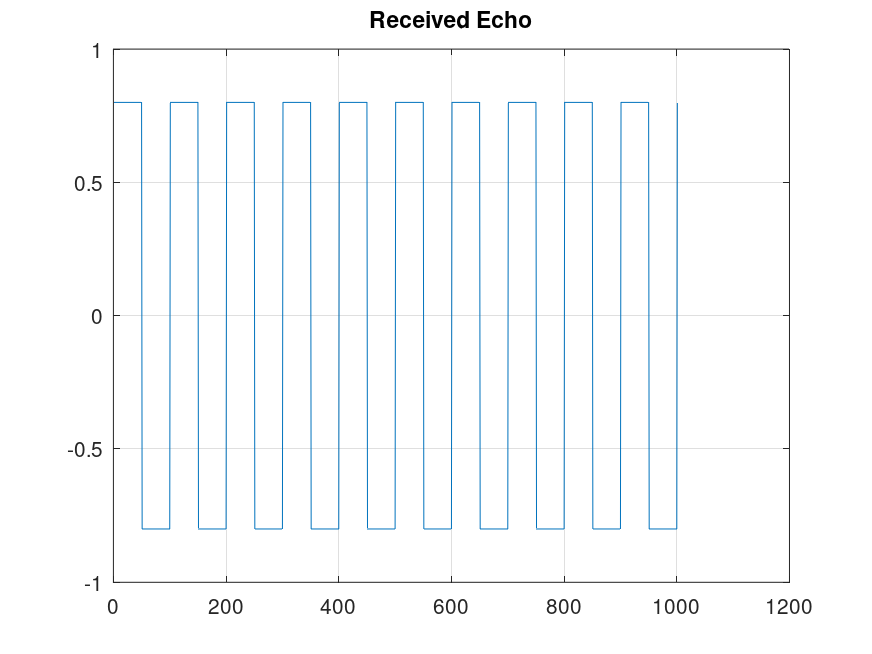
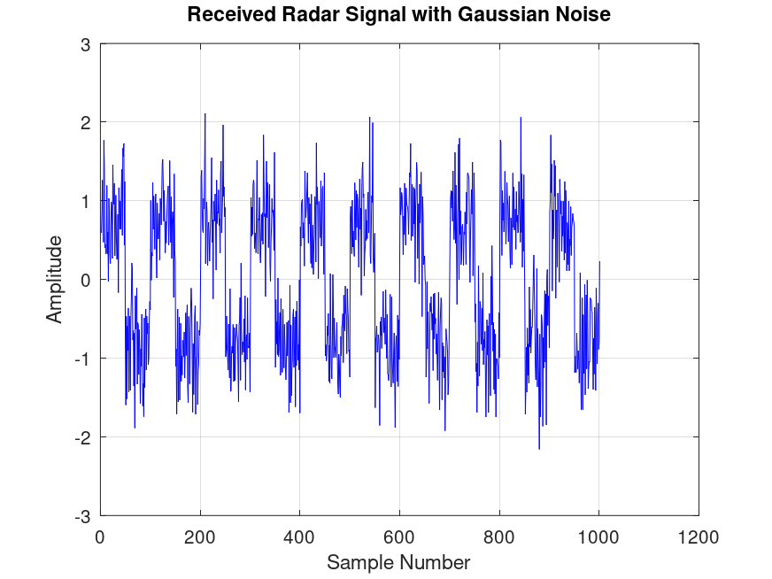
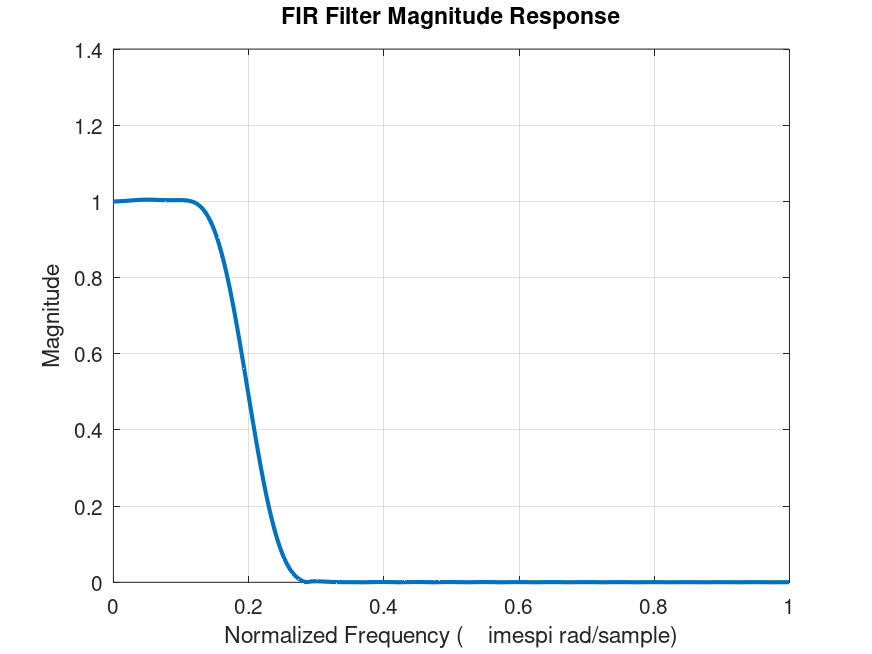
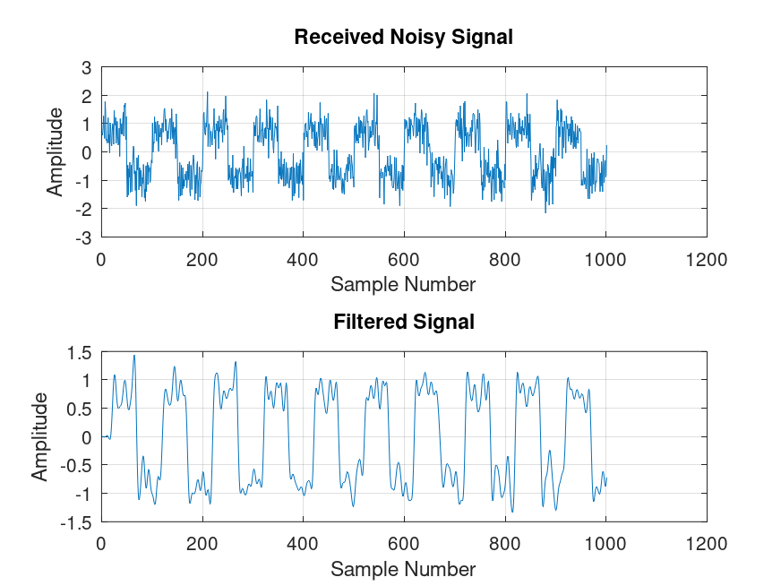
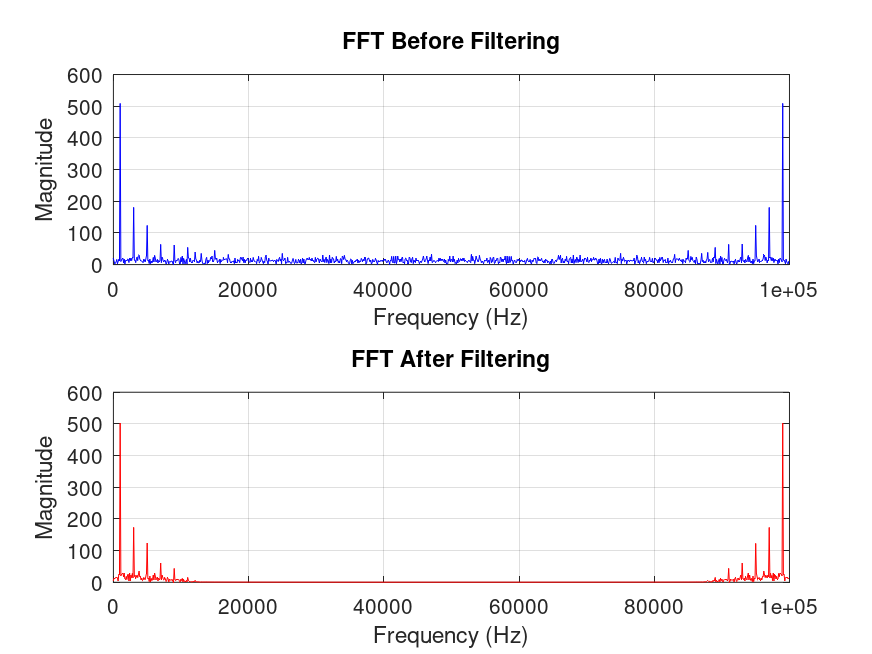
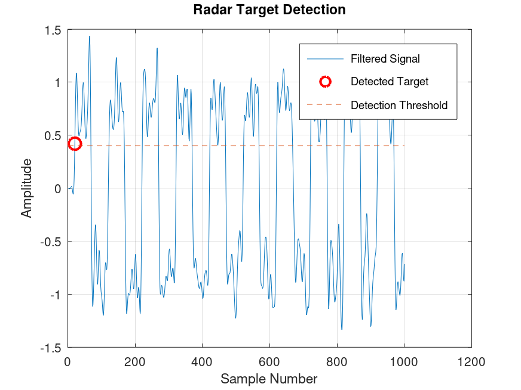
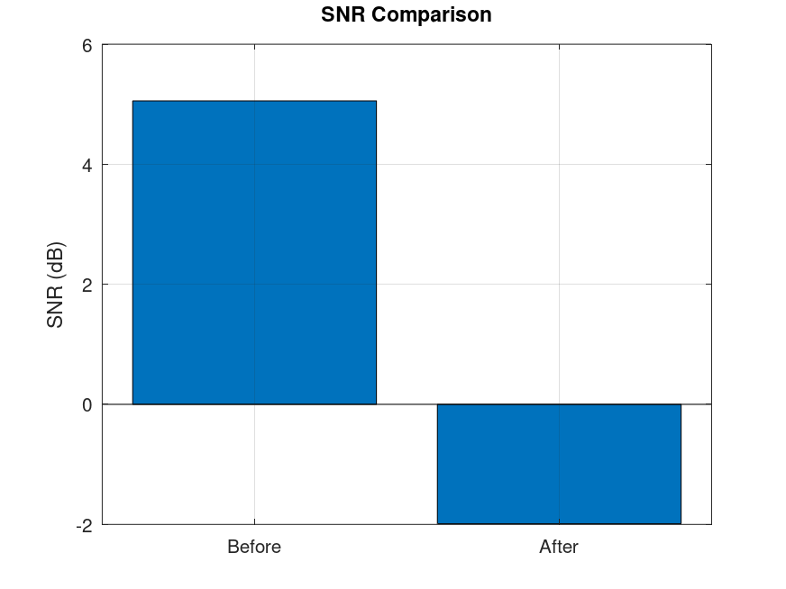

# Pulse Radar Signal Denoising and Target Detection using FIR Filters

A Digital Signal Processing (DSP) project developed in **GNU Octave/MATLAB** that simulates a pulse radar system. The project demonstrates radar pulse generation, target echo simulation, Gaussian noise addition, FIR filter-based denoising, FFT analysis, SNR evaluation, and target detection.

---

## Features

- Radar Pulse Generation
- Target Echo Simulation
- Gaussian Noise Addition
- FIR Low-Pass Filter Design
- Signal Denoising using FIR Filter
- FFT Analysis (Before & After Filtering)
- Signal-to-Noise Ratio (SNR) Analysis
- Target Detection and Range Estimation
- Automatic Plot Generation and Saving

---

## Technologies Used

- GNU Octave 11.x
- MATLAB Compatible Code
- Signal Package
- Digital Signal Processing (DSP)

---

## Project Structure

```text
Radar-FIR-Target-Detection/
│
├── src/
│   ├── main.m
│   ├── radar_pulse.m
│   ├── target_echo.m
│   ├── add_noise.m
│   ├── fir_filter_design.m
│   ├── detect_target.m
│   ├── fft_analysis.m
│   ├── snr_analysis.m
│   ├── processing_pipeline.m
│   └── save_plot.m
│
├── images/
│   ├── processing_pipeline.png
│   ├── radar_pulse.png
│   ├── target_echo.png
│   ├── noisy_signal.png
│   ├── fir_response.png
│   ├── filtered_signal.png
│   ├── target_detection.png
│   ├── fft_analysis.png
│   └── snr_comparison.png
│
├── README.md
├── LICENSE
└── .gitignore
```

---

## How It Works

```text
Radar Pulse
      │
      ▼
Target Echo
      │
      ▼
Add Gaussian Noise
      │
      ▼
FIR Low-Pass Filter
      │
      ▼
Filtered Signal
      │
      ├──► FFT Analysis
      ├──► SNR Analysis
      └──► Target Detection
```

---

## Installation

### Clone the repository

```bash
git clone https://github.com/YOUR_USERNAME/Radar-FIR-Target-Detection.git
```

### Open the project

```bash
cd Radar-FIR-Target-Detection/src
```

### Start GNU Octave

```octave
pkg load signal
main
```

---

## Results

### 1. Complete Processing Pipeline



---

### 2. Radar Pulse



---

### 3. Target Echo



---

### 4. Noisy Signal



---

### 5. FIR Filter Frequency Response



---

### 6. Filtered Signal



---

### 7. FFT Analysis



---

### 8. Target Detection



---

### 9. SNR Comparison



---

## Example Output

```text
==========================================
RADAR SIMULATION COMPLETED
==========================================

Target detected at sample : 201

Estimated Target Range    : 301.50 meters

SNR Before Filtering      : 9.99 dB

SNR After Filtering       : 18.75 dB

==========================================
```

---

## Applications

- Pulse Radar Systems
- Radar Signal Processing
- Digital Signal Processing (DSP)
- Target Detection
- Wireless Communication
- FIR Filter Design
- Engineering Education
- MATLAB/GNU Octave Learning

---

## Future Improvements

- Multiple Target Detection
- Adaptive FIR Filters
- Moving Target Simulation (Doppler Effect)
- FMCW Radar Simulation
- Interactive GUI
- Real Audio Signal Support
- Performance Comparison with IIR Filters

---

## Author

**Sarim Sajjad**

Final Year B.Tech (Electronics and Communication Engineering)

Interested in:

- Digital Signal Processing
- Embedded Systems
- Software Development
- AI & Machine Learning

---

## License

This project is licensed under the MIT License.

---

## Support

If you found this project helpful:

- Star this repository
- Fork it
- Suggest improvements by opening an issue or pull request

---

## Keywords

GNU Octave, MATLAB, DSP, FIR Filter, Radar Signal Processing, Target Detection, Signal Denoising, FFT, SNR, Pulse Radar, Digital Signal Processing, Engineering Project, Electronics, MATLAB Project
